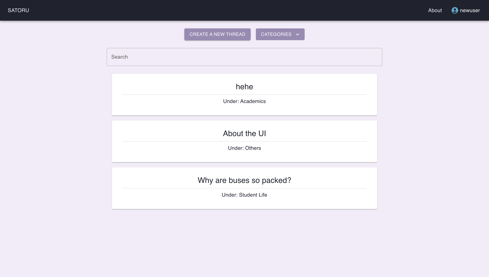
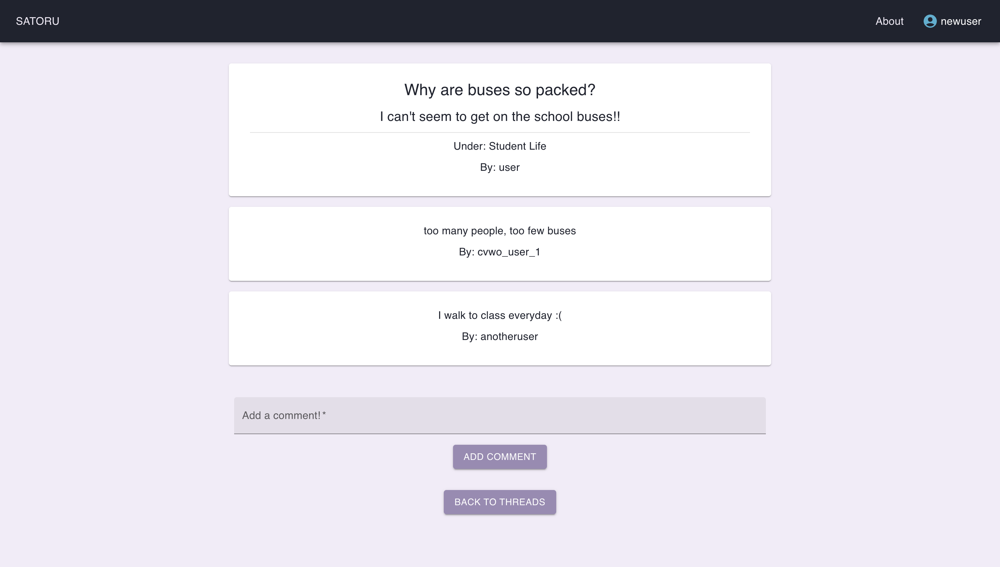

# Satoru

Satoru is a forum application which allows users to create, read, update and delete posts and comments.

### View deployed app at: [https://calm-paprenjak-39e501.netlify.app/](https://calm-paprenjak-39e501.netlify.app/)

## Screenshots
Home page



Post



## To clone application
```bash
git clone --recurse-submodules https://github.com/ngjianyi/Forum-Application.git
```

## Running the frontend app locally

```bash
cd Forum-frontend
```

1. Install dependencies for the project by entering this command:

```bash
yarn install
```

3. Run the app in development mode by entering this command:

```bash
yarn start
```

4. Open [http://localhost:3000](http://localhost:3000) to view it in the browser.

## Running the backend locally

```bash
cd Forum-backend
```

1. Install dependencies for the project by entering this command:

```bash
bundle install
```

3. Run the app in development mode by entering this command:

```bash
rails s -p 4000
```

4. Open [http://localhost:4000](http://localhost:4000) to view it in the browser.

